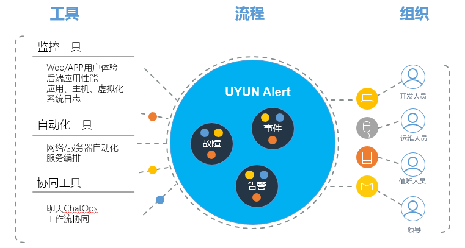

# 1.1    产品概述
　　优云Alert是互联网时代集中管理告警的平台，她面向运维中最关键的日常值班与故障处理场景，是运维协作的基础。其优秀的告警关联能力，可以让值班人员从纷杂的告警中解脱出来，大大降低无效告警的干扰。
- 超强的性能，有效抵御告警风暴
- 告警标签化，多视角管理告警
- 分析可视化，依据故障时间、拓扑相关性找根因
- 关联自动化，内置强大的关联规则引擎
- 便于扩展，提供接入与消费数据的OpenAPI

