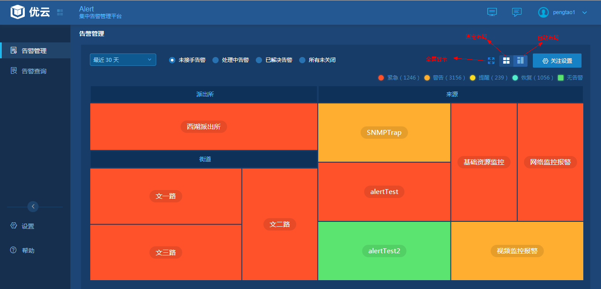
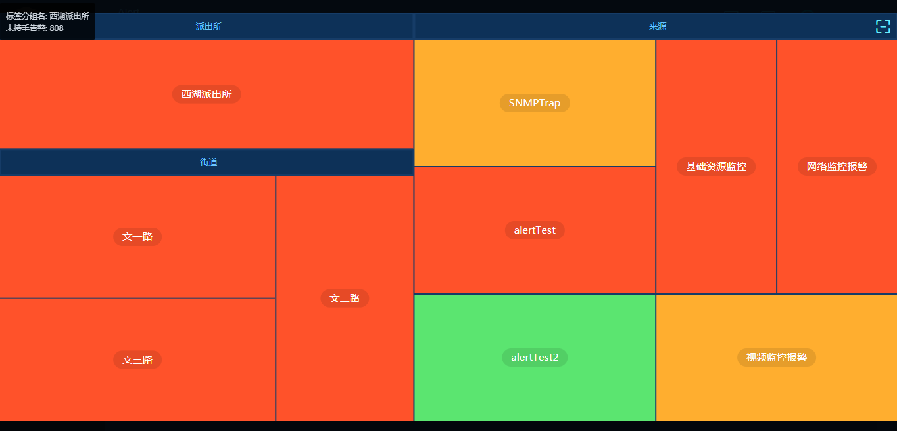

# 3.1.2    编辑看板
　　值班人员可以通过选择告警标签，圈选/编辑要管理的告警，以便进行管理分工，快速查看自己所关心的告警。  
　　在告警看板上可以选择最近1小时至最近30天不同时间粒度的告警，告警看板布局支持自动布局和固定布局两种方式。自动布局中，每个标签方块大小根据方块内的告警数量比例显示大小。固定布局中，每个标签方块显示大小一致。热图看板支持最大化。如下图所示：  
  
  
