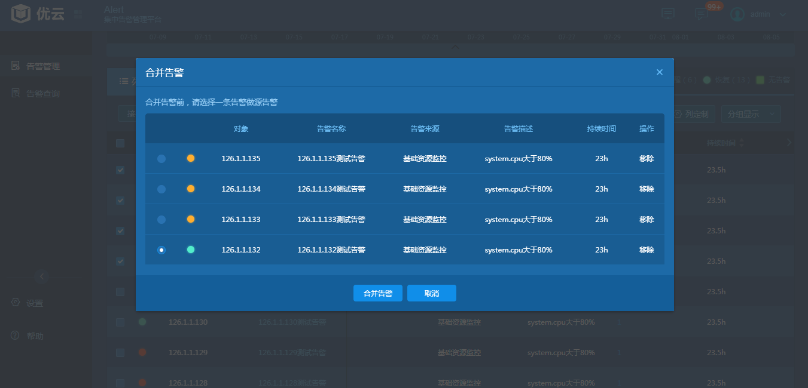

# 3.2.2.7 合并告警
　　 为了避免派发过多的工单，Alert支持把相关的告警合并到源告警。在列表视图或时间线视图选择多条告警，点击[合并告警]按钮，之后弹出合并告警对话框，在对话框中选择一条告警作为源告警并确定；如下图所示：  
   
　　 在合并告警之后，可以在列表视图点击源告警查看相关告警，选中原告警点击[解除告警]则解除合并关系。
告警合并有如下约束条件：  
- 一条告警最多只能从属于一条源告警  
- 源告警不支持嵌套  
- 已合并的告警不支持过滤，而源告警可以  
- 已合并的告警的状态遵循源告警，源告警一旦被关闭，被合并的告警也被关闭。  

