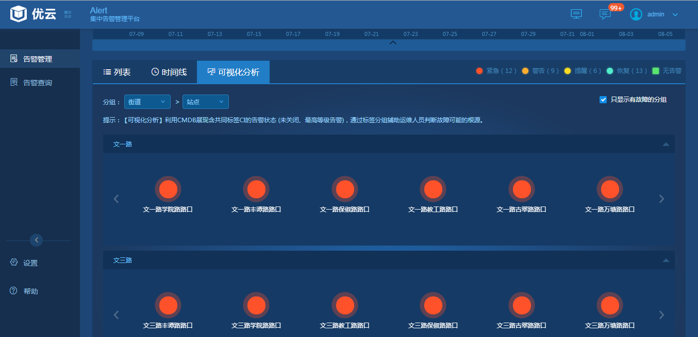
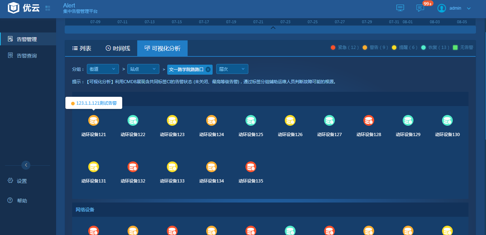
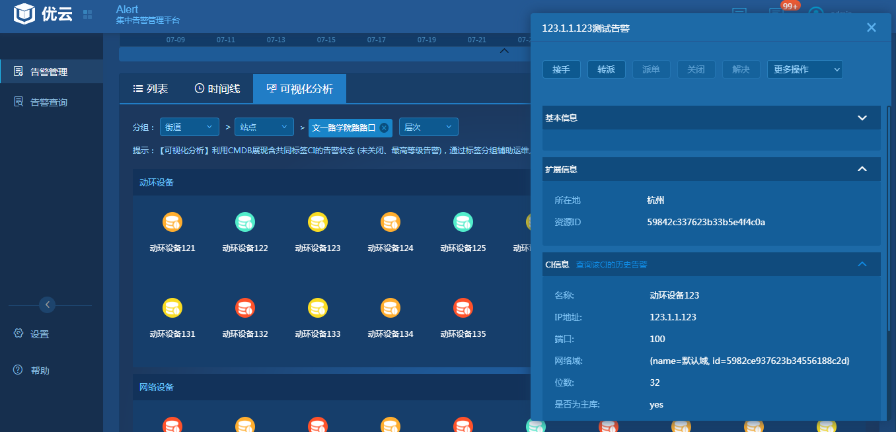

# 3.2.4    可视化分析
　　 可视化分析页以标签分组方式展示告警，可以方便的在可视化分析视图分析告警发生的设备，从而找到发生告警的设备。从热图进入可视化分析，可根据标签对设备进行分组展示。在热图或者列表页进入时，会查询出所带标签的所有资源信息，列如：选择西湖派出所，则会查询CMDB拥有西湖派出所所有的资源进行分组展示。在勾选“只显示有故障的分组”，则没有故障的资源则不显示。分组或者资源颜色都显示最高级别的颜色。如下图：  
   
　　 点击一个资源分组，还可以进行一次分组显示，最后一层则显示了资源。点击资源可显示资源上发生的告警，点击告警会显示告警详情页。如下图：  
   
   