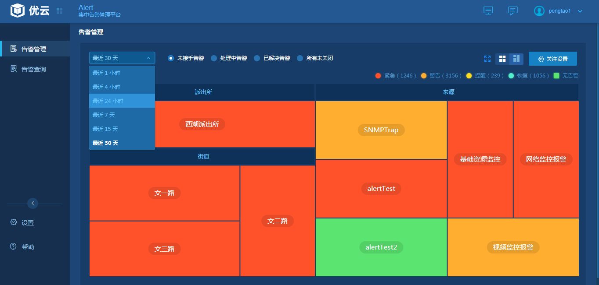

# 3.2    告警处理和分析
　　值班人员可以快速查看个标签分组内包含设备的总体报警状态，以便从整体到细节进行分析，避免限于过多细节。  
　　查看之前需圈选好告警范围，在告警热图看板中以不同颜色区分不同等级的告警，红色为紧急，橙色为警告，黄色为提醒，绿色为恢复，浅绿色为该标签下无告警。热图默认显示最近一小时的告警，可根据需要勾选时间查看最近时间的告警，如下图所示：  
  
　　值班人员可以从热图方块往下钻，查看即时的告警清单，以便从分析告警的原因和影响范围。  
　　点击热图方块进入告警列表，默认显示60分钟内的告警趋势并支持按时间筛选，并可以通过字段对列表进行过滤、排序。并会统计当前过滤条件下各类告警的数量。  
　　系统支持列表和时间线两种方式查看告警。  
